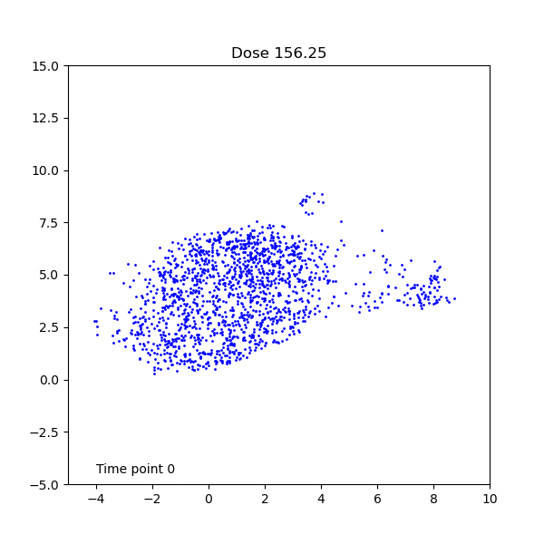

To access and explore the scDINO results, we have developed a Shiny app that allows users to visualize the results of scDINO.
The app is available: [Temporal Exploration of scDINO](https://lippincm.shinyapps.io/temporal_shiny_app/)

We also generate dynamic UMAP visualization of the scDINO results.
As an example here we show the UAMP results of the scDINO analysis of the HeLa cell line dataset.
We show the dose repsonse over time of the HeLa cell line dataset when treated with Staurosporine.

vs.

