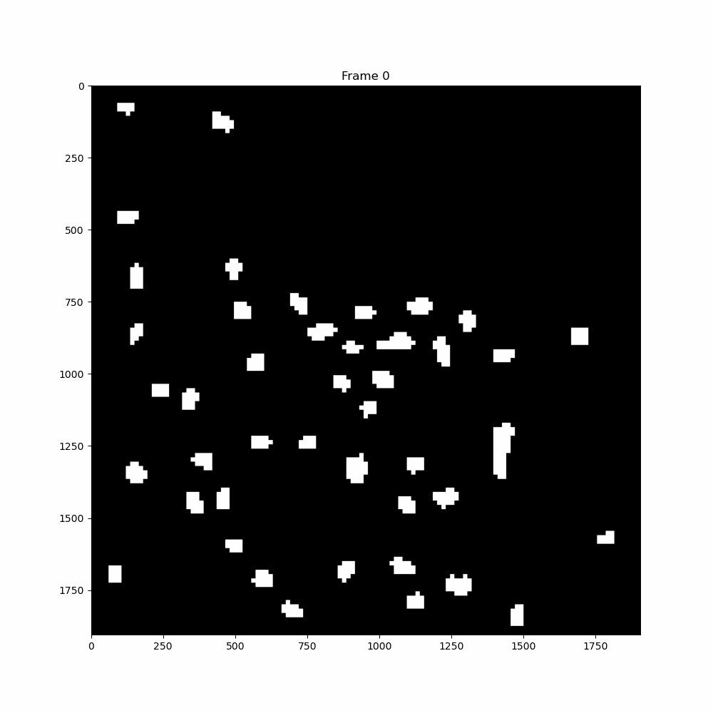

Using [SAM2](https://github.com/facebookresearch/segment-anything-2) to track objects (Nuclei) over time in a live-cell time-lapse movie of HeLa cells.

## Tracking of a single FOV of multiple cells

## Tracking of a single cell
We use StarDist for preliminary nuclei segmentation of each FOV at the first time point.
We use SAM2 to track these objects across time and output binary masks.
These masks will be added back into CellProfiler for feature extraction.
