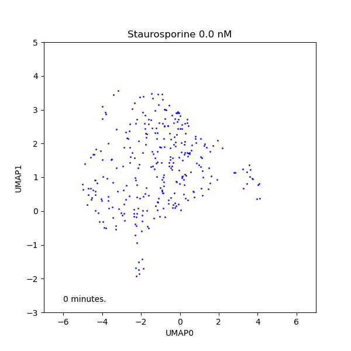
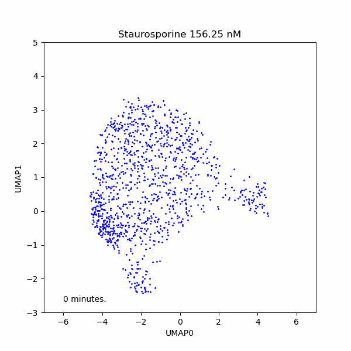

# scDINO Processing
We need to wrangle the data to be in the correct format for visualization and analysis.
We will do this by running a series of notebooks that will process the data and generate the necessary files for the Shiny app.
## Running the notebooks
To run those notebooks run the following command:
```bash
source process_scDINO.sh
```

## Visualizing the results and the Shiny app
To access and explore the scDINO results, we have developed a Shiny app that allows users to visualize the results of scDINO.
The app is available: [Temporal Exploration of scDINO](https://lippincm.shinyapps.io/temporal_shiny_app/)

We also generate dynamic UMAP visualization of the scDINO results.
As an example here we show the UAMP results of the scDINO analysis of the HeLa cell line dataset.
We show the dose repsonse over time of the HeLa cell line dataset when treated with Staurosporine.

vs.

